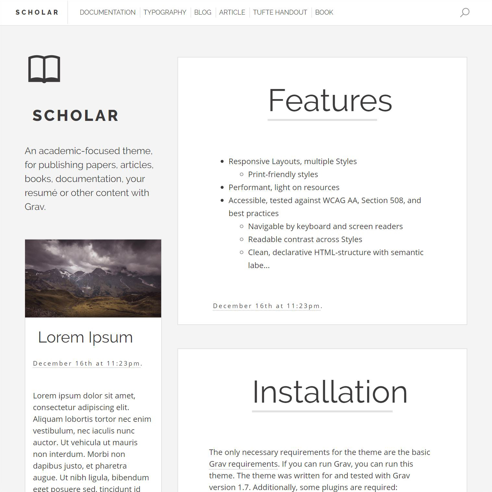

# Scholar Skeleton

## Description

The **Scholar** Skeleton is an assembled package, including the [Grav CMS](http://github.com/getgrav/grav), the [Scholar Theme](https://github.com/OleVik/grav-theme-scholar), necessary plugins, and sample content. Once installed, you're ready to start using Scholar, an academic-focused theme, for publishing papers, articles, books, documentation, your resumé or other content with Grav.

## Installation

Installing the Scholar Skeleton can be done by downloading the newest [release](https://github.com/OleVik/grav-skeleton-scholar/releases) and extracting it to your webserver. From there it should work without issue, given that Grav's [requirements](https://learn.getgrav.org/basics/requirements) are met and you've followed the [installation](https://learn.getgrav.org/basics/installation) instructions. The Admin-plugin is recommended for easy management and editing of content.

### Installing with Git

This repository references some other repositories as submodules, thus you have to clone recursively to get their contents: `git clone --recurse-submodules https://github.com/OleVik/grav-skeleton-scholar.git`. To reduce the overhead of Git's history, clone shallowly:

`git clone --recurse-submodules --shallow-submodules --depth 1 https://github.com/OleVik/grav-skeleton-scholar.git`

## Usage and Configuration

See the [theme's repository](https://github.com/OleVik/grav-theme-scholar/) for instruction and details.

## Development

1. Check `git status` for changes to submodules
2. Update them with `git submodule update --init --recursive`
3. Add local changes with `git add --all`
4. Commit changes with `git commit -m "Commit message"`
5. Synchronize changes with `git push`
