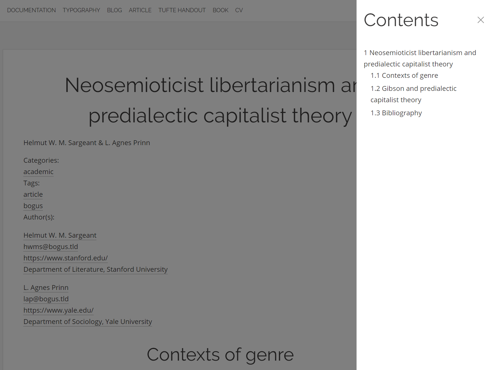

The _Article_ Component displays a standalone piece of writing, optimized for reading:


If a Page has structured headings, which it should for accessibility, it will also include a menu-button in the top-right corner, which opens a menu for navigating the content. These links point to headings in the Page.



For semantic accessibility, all heading-elements should be hierarchically structured properly, from level 1 to 6. In Markdown, this would look like:

```markdown
# H1 Heading

## H2 Heading

### H3 Heading

#### H4 Heading

##### H5 Heading

###### H6 Heading
```

## Author metadata

This Page Type also has extended support for taxonomy-data, in this case author metadata:

```yaml
title: "Neosemioticist libertarianism and predialectic capitalist theory"
menu: "Article"
subtitle: "Helmut W. M. Sargeant & L. Agnes Prinn"
taxonomy:
  categories: academic
  tags: [article, bogus]
  author:
    - name: "Helmut W. M. Sargeant"
      email: "hwms@bogus.tld"
      url: "https://www.stanford.edu/"
      affiliation: "Department of Literature, Stanford University"
    - name: "L. Agnes Prinn"
      email: "lap@bogus.tld"
      url: "https://www.yale.edu/"
      affiliation: "Department of Sociology, Yale University"
```
