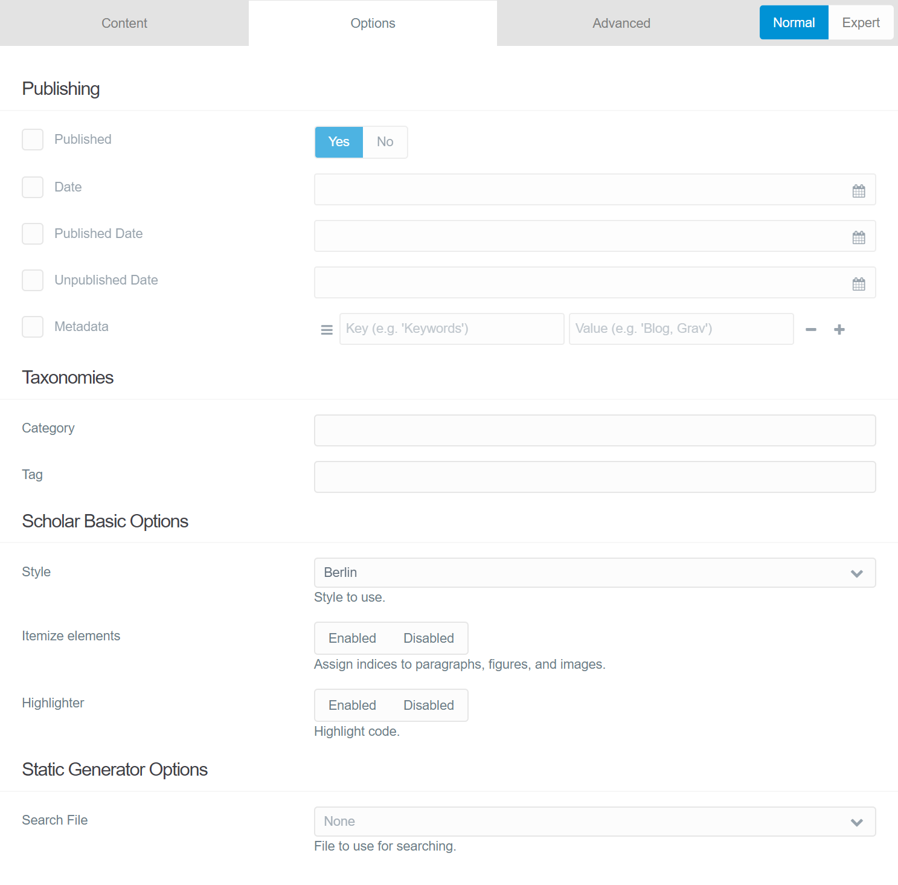

By default, only a small subset of options are available when editing a Page:



These are [registered](https://github.com/OleVik/grav-theme-scholar/blob/master/blueprints/default.yaml) with the prefix `header.theme.`, so that in a saved Page they are in the FrontMatter, for example:

```yaml
title: Blueprints
theme:
  style: metal
  itemize: false
  highlighter: false
```

Any Page can pass options to the Scholar-theme through the `theme`-property in its FrontMatter, to alter what the theme does to the Page. For example, if you wanted to not itemize paragraphs, figures, and images, you would set `theme: itemize: false`.

## Customizing the options

All possible options are available in [basic.yaml](https://github.com/OleVik/grav-theme-scholar/blob/master/blueprints/partials/basic.yaml), [advanced.yaml](https://github.com/OleVik/grav-theme-scholar/blob/master/blueprints/partials/advanced.yaml), and [expert.yaml](https://github.com/OleVik/grav-theme-scholar/blob/master/blueprints/partials/expert.yaml), and will by default be editable in the Admin-interface in the theme's options. If you are familiar with [Grav's blueprints](https://learn.getgrav.org/16/forms/blueprints), you will notice that [this theme's fields](https://github.com/OleVik/grav-theme-scholar/blob/master/blueprints.yaml) are set dynamically:

```yaml
data-fields@:
  [
    '\Grav\Theme\Scholar::getConfigBlueprintFields',
    "user://themes/scholar/blueprints/partials/basic.yaml",
  ]
advanced:
type: tab
title: PLUGIN_ADMIN.ADVANCED
data-fields@:
  [
    '\Grav\Theme\Scholar::getConfigBlueprintFields',
    "user://themes/scholar/blueprints/partials/advanced.yaml",
  ]
expert:
type: tab
title: PLUGIN_ADMIN.EXPERT
data-fields@:
  [
    '\Grav\Theme\Scholar::getConfigBlueprintFields',
    "user://themes/scholar/blueprints/partials/expert.yaml",
  ]
```

Your own, custom [child-theme](https://learn.getgrav.org/16/themes/customization#theme-inheritance) can integrate any of these options as you see fit.

## Customizing the blueprints

The helper-method `getConfigBlueprintFields()` lets you load a blueprint-file from a given path. It can also take a `prefix`-parameter, so you can use these options as you wish in other blueprints. For example, if you want to expose all the theme's options to each Page, you could change [/blueprints/default.yaml](https://github.com/OleVik/grav-theme-scholar/blob/master/blueprints/default.yaml) to:


```yaml
title: Scholar Options
extends@:
  type: default
  context: blueprints://pages

form:
  fields:
    tabs:
      type: tabs
      fields:
        options:
          type: tab
          fields:
            scholar_basic:
              type: section
              title: THEME_SCHOLAR.ADMIN.TITLES.BASIC
              underline: true
              data-fields@:
                [
                  '\Grav\Theme\Scholar::getConfigBlueprintFields',
                  "theme://blueprints/partials/basic.yaml",
                  "header.theme.",
                ]
        advanced:
          type: tab
          fields:
            scholar_advanced:
              type: section
              title: THEME_SCHOLAR.ADMIN.TITLES.ADVANCED
              underline: true
              data-fields@:
                [
                  '\Grav\Theme\Scholar::getConfigBlueprintFields',
                  "theme://blueprints/partials/advanced.yaml",
                  "header.theme.",
                ]
            scholar_expert:
              type: section
              title: THEME_SCHOLAR.ADMIN.TITLES.EXPERT
              underline: true
              data-fields@:
                [
                  '\Grav\Theme\Scholar::getConfigBlueprintFields',
                  "theme://blueprints/partials/expert.yaml",
                  "header.theme.",
                ]
```

You can also override and customize all blueprints as needed, as this [example in Grav's docs](https://learn.getgrav.org/16/forms/blueprints/example-config-blueprints) show.
