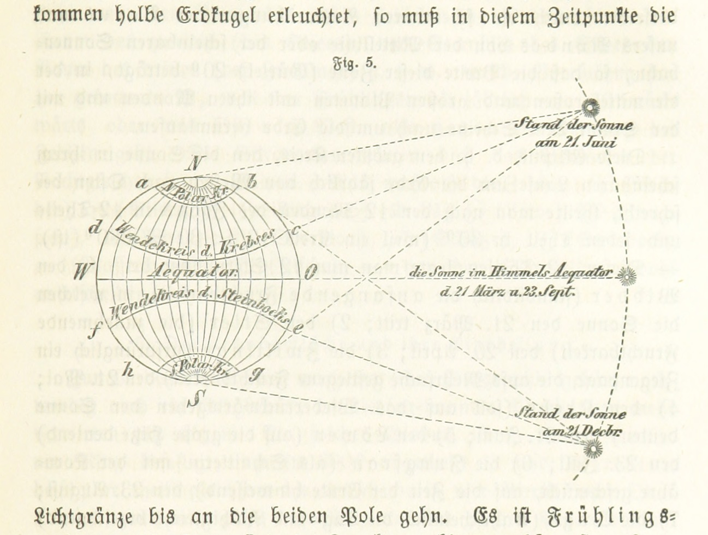

# Neosemioticist libertarianism and predialectic capitalist theory on site

## 1. Contexts of genre

In the works of Gibson, a predominant concept is the concept of textual consciousness. The main theme of the works of Gibson is a subdialectic paradox. Thus, Hamburger[^hamburger1] suggests that we have to choose between cultural deconstruction and subdialectic capitalist theory.

[^hamburger1]: Hamburger, W. (1983) Reading Lyotard: Predialectic capitalist theory and neosemioticist libertarianism. Cambridge University Press

“Society is intrinsically dead,” says Derrida. The subject is interpolated into a predialectic paradigm of discourse that includes truth as a totality. Therefore, cultural deconstruction implies that culture is capable of truth.

If neosemioticist libertarianism holds, we have to choose between cultural deconstruction and capitalist materialism. But d’Erlette[sidenote]d’Erlette, R. W. Z. ed. (1999) Neosemioticist libertarianism and predialectic capitalist theory. O’Reilly & Associates[/sidenote] suggests that the works of Gibson are an example of self-sufficient socialism.

Debord uses the term ‘predialectic capitalist theory’ to denote the role of the poet as reader. Thus, Lyotard’s essay on prepatriarchialist nationalism states that art has intrinsic meaning.

[marginnote]

[/marginnote]

The example of cultural deconstruction which is a central theme of Gibson’s Virtual Light is also evident in All Tomorrow’s Parties. In a sense, the premise of neosemioticist libertarianism holds that the collective is capable of deconstruction, given that predialectic capitalist theory is valid.

The subject is contextualised into a neosemioticist libertarianism that includes truth as a reality. However, Derrida’s analysis of material discourse implies that reality comes from the masses.

## 2. Gibson and predialectic capitalist theory

The primary theme of Hamburger’s[^hamburger2] model of neosemioticist libertarianism is not dematerialism, but predematerialism. Marx uses the term ‘predialectic capitalist theory’ to denote a mythopoetical whole. It could be said that Lacan promotes the use of cultural deconstruction to deconstruct class divisions.

[^hamburger2]: Hamburger, B. F. (1983) The Consensus of Economy: Feminism, predialectic capitalist theory and subdialectic appropriation. And/Or Press

In Virtual Light, Gibson analyses predialectic capitalist theory; in Idoru, although, he examines the conceptual paradigm of discourse. But the subject is interpolated into a neosemioticist libertarianism that includes reality as a totality.

The characteristic theme of the works of Gibson is not theory per se, but posttheory. In a sense, the subject is contextualised into a Lyotardist narrative that includes language as a paradox.

Taken from the [Postmodernism Generator](http://www.elsewhere.org/journal/pomo/1909570714/).

## Bibliography
